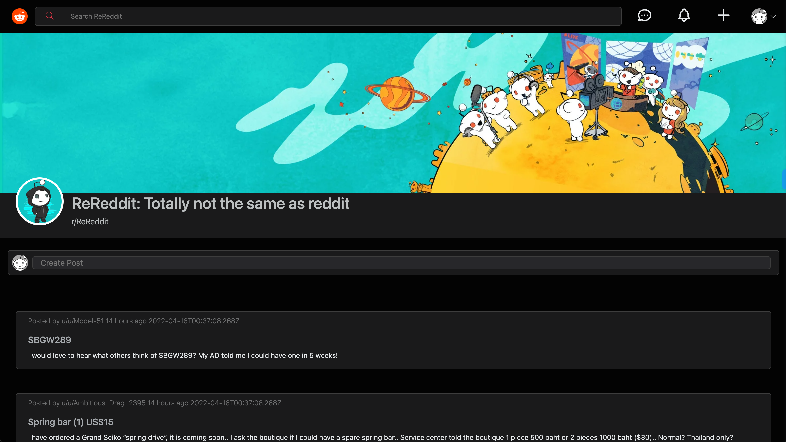

# Re-Reddit

  [](http://opensource.org/licenses/ISC)

  ## Description
  Reddit is an extremely popular social media platform known for its 'subreddits' that function as individual forums around specific topics. We wanted to do our best to clone some of its functionality, in what we call 'Re-Reddit.'

    ```md
    AS someone looking to use Re-Reddit
    I WANT the ablility to create an account and log-in
    SO THAT a device isn't limited to just a single user
	I WANT to be able to expand posts
	SO THAT I can see them better
    I WANT to be able create posts
	SO THAT I can contribute to the platform
    ```

  For this project, we utilized the following technologies:
  - React, Bootstrap, Node.js, Express.js, MongoDB, and Mongoose

  Future plans for enhancement:
  - Add in ability to comment
  - Add in ability to upvote and downvote
  - Add in ability to create additional sub-re-reddits

  ## Contents

  1. [Installation](#installation)
  2. [Project Usage](#usage)
      1. [Visuals](#visuals)
  3. [Licenses](#licenses)
  4. [Testing](#testing)
  5. [How to contribute](#contributing)
  6. [Project Credits](#credits)
      1. Authors
      2. Additional Acknowledgements
  7. [Have Questions?](#questions)

  ## [Installation](#installation)
  This application is running on a Heroku hosted site. 
  You can find it here: [Re-reddit](https://re-reddit-app.herokuapp.com/)

  If you desire to run Re-Reddit locally, follow these setup steps:
  To clone repo: 
  ```md
  git clone git@github.com:hak9292/Re-Reddit.git
  ```

  From within mongo, execute the following command:
  ```md
  use rereddit
  ```
  Run 'npm install' at the root directory to install necessary dependencies for the server.
  cd into 'client' and run 'npm install' to install necessary dependencies for the client
  Run 'npm run start-dev' to start the server.
  Run 'npm start' to start the React application.
  Navigating to localhost:[PORT] should take you directly to the login/setup screen.


  ## [Project Usage](#usage)
  Interacting with Re-Reddit is as easy as navigating to the [Re-Reddit](https://re-reddit-app.herokuapp.com/) site.

  Create an account, and that will automatically log you in. Should you want to log out, click the log out button. Sign in with your credentials if you want to sign back in again.

  Click on a post to enlarge it, and click outside of the post modal to minimize it again. To create a post, click 'create post' and add your post.

  
  ### [Visuals](#visuals)
  


  ## [Licenses](#licenses)
  This project uses the ISC license.

  To find out more information on open source licenses, please refer to [https://choosealicense.com/](https://choosealicense.com/).

  ## [Testing](#testing)
  N/A

  ## [How to contribute](#contributing)
  If you would like to contribute to this project, follow the steps below.
  1. Fork the repo on GitHub.
  2. Clone the project to your own machine.
  3. Create a branch for your feature work.
  3. Commit changes to your own branch.
  4. Push your work back up to your fork.
  5. Submit a Pull request so that we can review your changes

  ## [Project Credits](#credits)

  Project Authors:

  [jcwashington](https://github.com/jcwashington)
  [hak9292](https://github.com/hak9292)
  [samrapow](https://github.com/samrapow)


  ## [Have Questions?](#questions)
    Contact any of the authors via email with your questions:
  * Hee Hoon Kim - <ak112997@gmail.com>
  * Sam Rapowitz - <samrapow@gmail.com>
  * Jasmine Washington - <jasmine.washington412@gmail.com>
